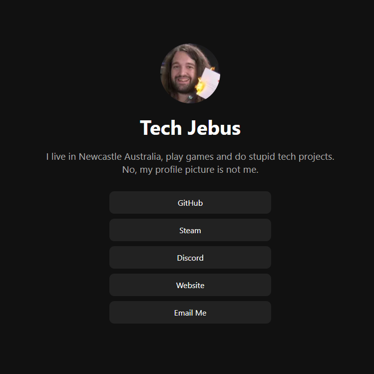

# 🌐 Tech Jebus - Profile Page

This is my custom personal profile page, inspired by sites like [guns.lol](https://guns.lol) and [Linktree](https://linktr.ee), but fully self-hosted, fast, and lightweight. It's built with plain HTML and CSS — no JavaScript, no frameworks, just clean and simple. You can view my live profile page [here](https://techjebus.games).




---

## 🔗 Links

- [Discord](https://discord.com/users/techjebus)
- [Email](mailto:techjebus@techjebus.games)

---

## 🧰 Tech Stack

- HTML5
- CSS3

That’s it. No dependencies.

---

## 📁 File Structure

```
/
├── index.html         # Main page
├── style.css          # Stylesheet
├── assets/
│   └── avatar.webp    # Profile image
└── README.md          # You're reading it
```

---

## 🚀 Deploy Your Own

You can fork this repo and customize it for your own use:

1. Clone the repo:
   ```bash
   git clone https://github.com/tech-jebus/profile-page.git
   cd profile-page
   ```

2. Replace the content in `index.html` and `style.css` with your own info.

3. Add your avatar to the `assets/` folder and update the filename in the HTML if needed.

---

### 🌍 Hosting with GitHub Pages

You can deploy this for free using GitHub Pages:

1. Push the code to a public GitHub repo.
2. Go to **Settings > Pages**.
3. Under **Source**, select `main` branch and root folder.
4. Your site will be live at:  
   `https://yourusername.github.io/your-repo-name`

---

## 📸 Credit

This site is 100% custom and self-maintained by ME.  
Feel free to use the template, just don’t be a dick and steal the name.

---

## 🛠 License

MIT — do what you want, just don’t be evil.
